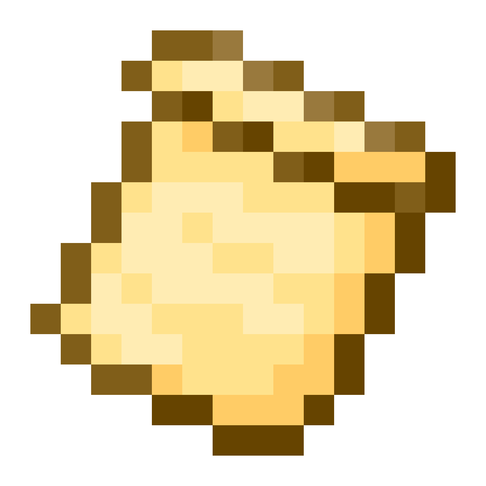

# Silk API: Rope, Stick

**This system includes all advanced interfaces related to items in the Silk API, such as tools, weapons, crossbows, equipment, food, etc., and lets modders create unique items.**

